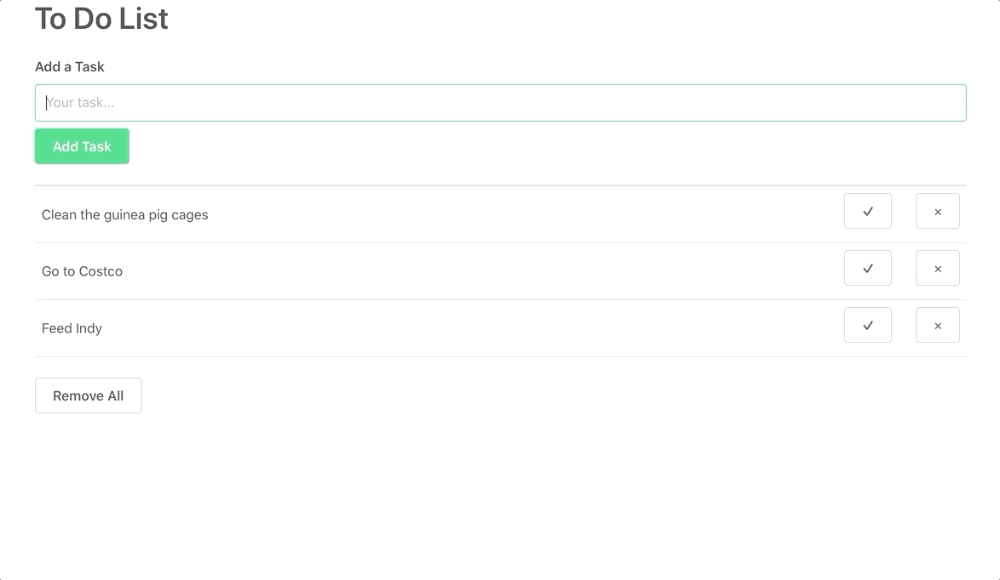

# React To-Do List
My first React project. Bootstrapped with [Create-React-App](https://github.com/facebook/create-react-app)

## Features
- Add a task
- Automatic task reordering based on input order and completed status
- Mark as complete and remove individual tasks
- Clear all tasks 
- Task data is stored in browser session storage
- Form validation to prevent blank/empty tasks

## Demo
This project is currently hosted on GitHub pages. You can try it out [here](https://alecbar.github.io/React-ToDo/)!

Or check it out below:

